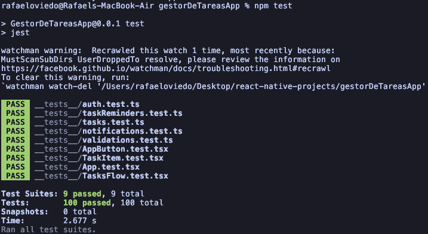

# Gestor de Tareas

## ¿De qué va la app?

Aplicación móvil para organizar tareas personales. Permite registrarse, iniciar sesión, crear tareas, marcarlas como completadas o pendientes y eliminarlas. Cada usuario tiene su propia lista, guardada en el dispositivo. La sesión se mantiene al cerrar y volver a abrir la app, hasta pulsar **Cerrar sesión**.

Las tareas pueden incluir recordatorios mediante notificaciones locales a los 10 segundos, 30 segundos, 1 minuto o 5 minutos. La app funciona sin backend ni conexión a internet.

## Stack

- React Native CLI 0.87.1 y React 19.2.3, sin Expo.
- TypeScript.
- React Navigation con Native Stack para la navegación.
- AsyncStorage para guardar usuarios y tareas.
- Notifee para las notificaciones locales en iOS y Android.
- Jest y React Native Testing Library para los tests.

## Instalación y ejecución

### Requisitos

- Node.js 22.11.0 o superior y npm.
- **iOS:** macOS, Xcode con un simulador instalado, Ruby y Bundler. El proyecto usa Ruby 3.1.4 y Bundler 2.3.26 en `Gemfile.lock`.
- **Android:** Android Studio, Android SDK y JDK configurados, con un emulador o dispositivo conectado.

### Instalar dependencias

Desde la carpeta del proyecto:

```sh
npm ci
```

Para iOS, instalar también las dependencias nativas:

```sh
bundle install
cd ios
bundle exec pod install
cd ..
```

### Ejecutar la app

Iniciar Metro desde la raíz del proyecto:

```sh
npm start
```

Con Metro abierto, ejecutar en otra terminal desde la misma carpeta:

**iOS**, con el simulador de iPhone abierto:

```sh
npm run ios
```

**Android**, con el emulador abierto o un dispositivo conectado con depuración USB:

```sh
npm run android
```

Ejecutar los comandos sin `sudo`. Al abrir la app, registrar una cuenta e iniciar sesión. Para probar los recordatorios, crear una tarea con la opción **10 segundos** y aceptar el permiso de notificaciones; en Android, habilitar también Alarmas y recordatorios si la app lo solicita.

## Ejecutar los tests

Con las dependencias instaladas (`npm ci`), ejecutar desde la raíz del proyecto:

```sh
npm test
```

Los tests usan Jest y React Native Testing Library. No requieren iniciar Metro, abrir un emulador ni compilar la app.


